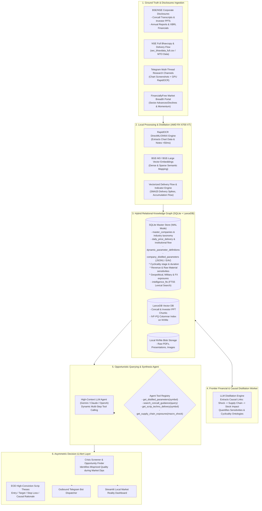

# Bottom-Up Reality Model & Techno-Funda Intelligence Engine
## System Master Architecture & Specification

---

## 1. Executive Summary & The Core North Star Objective

The foundational objective of this system is **NOT** merely to act as a mechanical daily tip generator. 

The true objective is to build a **Deep, Interconnected, Bottom-Up Relational & Causal Reality Model of the Market** that serves as an asymmetric information and conviction edge—especially during **market panics, macroeconomic shocks, sector corrections, and broad market sell-offs**.

### The Core Thesis: Reality Modeling via Corporate Disclosures
By systematically ingesting, distilling, and connecting hundreds of **Earnings Conference Call Transcripts (Concalls), Investor Presentations, Annual Reports, and Regulatory Disclosures**, the system constructs a living multi-dimensional relational map:

$$\text{Stock} \longleftrightarrow \text{Sector / Value Chain} \longleftrightarrow \text{Global Geography} \longleftrightarrow \text{Macro, Geopolitical \& Military Drivers}$$

Across corporate disclosures, managements continually reveal the real-world plumbing of their businesses:
- **Supply Chain & Input Dependencies**: Who supplies whom, raw material dependencies, single-source vulnerabilities, and freight exposure (e.g., Red Sea shipping rerouting, Suez canal bottlenecks, domestic vs. imported coking coal).
- **Geopolitical, Trade & Military Factors**: Impact of export bans, defence indigenization / DAP offsets, US/EU tariffs, currency fluctuations (USD/INR, JPY carry trade), and anti-dumping duties.
- **Regulatory & Political Policies**: Direct beneficiary transmission mechanisms (e.g., PLI scheme tranches, sugar ethanol blending mandates, power transmission Capex tenders).
- **Capital Cycles & Operating Leverage**: Greenfield/brownfield capex timelines, peak revenue additions, capacity utilization inflections, and deleveraging milestones.

### The Asymmetric Market Edge
When the broader market panics or falls indiscriminately, retail and passive capital dump stocks without distinguishing between broken businesses and temporary collateral damage. 

With this pre-built, relational knowledge database ready:
1. **Know-How & Know-Why**: You instantly know the exact transmission mechanism of any shock across every stock in the database.
2. **Crisis Opportunism**: The system immediately identifies mispriced bargains—companies whose underlying earnings power, order book execution, and supply chains remain intact or even benefit from the crisis, while their stock price is artificially discounted.
3. **Live Querying & Scheduled Synthesis**: The LLM acts as an analytical agent over this structured knowledge graph, answering live macroeconomic stress-test queries and ranking high-conviction risk-reward setups when the market offers entry windows.

---

## 2. System Architecture Diagram

---

## 3. Hardware & Resource Budget Allocation

### Target Host Specifications
* **CPU**: Intel Core i5-12400F (6 Cores / 12 Threads, 2.5–4.4 GHz)
* **System RAM**: 16 GB DDR4 @ 3400 MT/s
* **GPU**: AMD Radeon RX 6700 XT (12 GB GDDR6 VRAM, 192-bit, 384 GB/s bandwidth, RDNA 2 / `gfx1031`)
* **Storage**: 1 TB NVMe SSD (200 GB dedicated free space)
* **OS**: Windows 11 Host with WSL2 (Ubuntu 24.04 LTS)

### Resource Budget Table

| Resource | Allocated Subsystem | Memory Limit | Strategy & Headroom |
| :--- | :--- | :--- | :--- |
| **GPU VRAM** | RapidOCR Engine (DirectML) | **1.2 GB** | Instant cold start, batch inference |
| **GPU VRAM** | BGE-M3 / BGE-Large Embeddings | **1.5 GB** | Batch size 128, FP16 execution |
| **GPU VRAM** | PyTorch / ROCm Matrix Calc | **1.0 GB** | Tensor operations for indicator calculation |
| **GPU VRAM** | **Total GPU Allocation** | **3.7 GB / 12.0 GB** | **8.3 GB (69%) Free Headroom** |
| **System RAM** | Windows 11 + WSL2 Base OS | **5.5 GB** | WSL RAM capped at 9 GB via `.wslconfig` |
| **System RAM** | Ingestion & Playwright Browser | **1.8 GB** | Headless browser automatically terminated after job |
| **System RAM** | SQLite WAL Cache & LanceDB | **1.5 GB** | `PRAGMA cache_size = -64000` (64 MB page cache) |
| **System RAM** | Python Async Core & Workers | **1.2 GB** | Worker pool capped at 4 processes |
| **System RAM** | **Total RAM Allocation** | **10.0 GB / 16.0 GB** | **6.0 GB (37.5%) Free Safety Headroom** |
| **Disk Space** | SQLite DB + LanceDB + Blob Cache| **~25 GB / Year** | 200 GB available; auto-pruning PDFs $>90$ days |

---

## 4. Documentation Index

The complete specification is organized into modular documents:

1. **`01_DATA_INGESTION_PIPELINE.md`**: Specification for Bhavcopy, Corporate Disclosures, Telegram Forum Threads, and Authenticated FinanciallyFree scraper.
2. **`02_PROCESSING_OCR_AND_VECTORS.md`**: GPU-accelerated RapidOCR, Concall PDF parsing, and LanceDB BGE-M3 vector embedding pipeline.
3. **`03_STORAGE_AND_DATABASE_SCHEMA.md`**: SQLite 3 WAL schema, FTS5 virtual tables, LanceDB schema, and query optimization patterns.
4. **`04_QUANT_SCREENING_AND_FACTOR_MODEL.md`**: Delivery spike mathematics, multi-factor scoring algorithm, and candidate filtration formulas.
5. **`05_CLOUD_AI_AGENT_AND_TOOL_CALLING.md`**: Online LLM agent orchestration, tool schema definitions, system prompts, and structured JSON outputs.
6. **`06_EXECUTION_ROADMAP_AND_VERIFICATION.md`**: Step-by-step implementation roadmap, unit tests, verification gates, and runbooks.
7. **`07_DYNAMIC_FINANCIAL_DISTILLATION_ENGINE.md`**: Dynamic EAV + JSON parameter engine, cyclicality ontologies, revenue sensitivities, and frontier knowledge distillation.
8. **`08_MACRO_POLICY_AND_CAUSAL_KNOWLEDGE_GRAPH.md`**: Macro policy feeds (Union Budget, RBI Surveys, Research Reports), recursive SQLite causal graph schema, and multi-hop transmission walks.
9. **`09_CRITICAL_REFINEMENTS_AND_ADVERSARIAL_AUDIT.md`**: Adversarial subagent stress tests, subtractions (eliminating brittle web scraping), and critical additions (SEBI Insider Trading, Bulk/Block deals, Forensic Solvency gates, and Panic Triggers).
